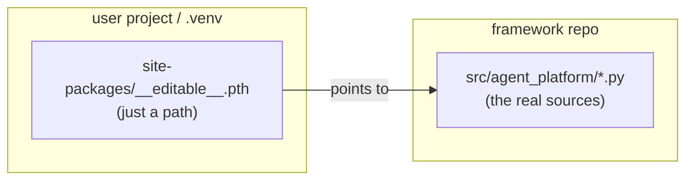

# agentic_platform — The dependency source: dev *editable* vs user *copy*

When a user project does `uv add` of the framework, **where** it gets the code from and
**how** it installs it changes everything: in development you want to see your changes
instantly, for a real user you want a stable, reproducible copy. This document explains
the difference, why it exists, and how `bootstrap.py` handles it on its own.

---

## The point in one line

> An **editable** install copies nothing: it puts a **pointer** to the framework
> sources into `site-packages`. A **normal** install makes a **copy** inside the
> `.venv`. The first is for those who *develop* the framework; the second for those who
> *use* it.

---

## The three scenarios

| | Who | `uv add` source | What ends up in the project's `.venv` | In `pyproject.toml` |
|---|---|---|---|---|
| **Dev (you, now)** | you develop the framework | local path → `--editable` | **a pointer** to the repo | `{ path = "...", editable = true }` |
| **User — PyPI** | uses the framework | `nodeflowlite` | **a copy** downloaded from PyPI | `"nodeflowlite>=0.1"` |
| **User — git** (pre-PyPI) | uses the framework | `git+https://github.com/.../nodeflowlite.git` | **a copy** built from the repo | git URL + commit pinned in `uv.lock` |

In **none** of the user cases does an editable pointer appear: it is a development
convenience, it never ends up in an end user's configuration.

---

## How the *editable* install works (dev)

`uv add --editable /path/to/the/repo`:

1. it **does not copy** the framework files;
2. it writes a pointer-file (`.pth`) into `site-packages` containing only the path to
   the sources, e.g. `/Users/you/git/agentic_platform/src`;
3. when the project does `import agent_platform`, Python follows the pointer and reads
   the **real `.py` files in the repo**.

Concrete check in an editable-installed project:

```bash
uv run python -c "import agent_platform; print(agent_platform.__file__)"
# -> /Users/you/git/agentic_platform/src/agent_platform/__init__.py   (the REPO, not the .venv)
```



### Important consequence: you still need a **restart**

Python **does not watch** the files: it reads and compiles the modules **once, at
process startup**, and keeps them in memory (`sys.modules`). So with editable:

- ✅ **no reinstall**: the sources are shared via the pointer;
- ⚠️ **you must restart the server** (Ctrl-C + `uv run python PlatformManager.py`): an
  already-running process holds the old version in memory.

(For development you can launch uvicorn with `--reload`, which restarts on file change
by itself — but that is a different thing, handled by the server, not by the install.)

---

## How the **normal** install works (user)

`uv add nodeflowlite` (PyPI) or `uv add "git+https://..."`:

1. `uv` downloads the package (from PyPI) or **clones the repo internally** into its
   cache (from git) — **the user clones nothing by hand**;
2. it builds a *wheel* and **copies** it into
   `project/.venv/lib/python3.x/site-packages/agent_platform/`;
3. from then on that copy is **frozen**: changes to the framework repo **do not** touch it.

```bash
uv run python -c "import agent_platform; print(agent_platform.__file__)"
# -> .../project/.venv/lib/python3.x/site-packages/agent_platform/__init__.py  (a COPY)
```

> It is exactly how you install `fastapi` or any other library: a copy in your
> environment, pinned to a precise version.

### Updating (user side)

| Source | How to update |
|---|---|
| **PyPI** | `uv add nodeflowlite@latest`, or bump the version and `uv lock --upgrade-package nodeflowlite` |
| **git** | re-point to a new commit/tag in the dependency |

`uv.lock` guarantees that, until you update explicitly, you always have the **exact same
version** (reproducibility).

---

## How `bootstrap.py` chooses on its own

The **same** script serves all scenarios: only the *source* changes, and the script
decides the mode based on it:

```python
def add_command(source: str) -> list[str]:
    # local path (existing folder) -> dev checkout -> editable
    if Path(source).expanduser().is_dir():
        return ["uv", "add", "--editable", source]
    # PyPI name or git URL -> normal dependency (copy)
    return ["uv", "add", source]
```

- **Source = local path** (dev case) → `uv add --editable <path>` → live pointer.
- **Source = `nodeflowlite` or a git URL** (user case) → `uv add <source>` → copy.

The default source is the `DEFAULT_SOURCE` constant in `bootstrap.py` (overridable with
a CLI argument or the `AGENT_PLATFORM_SOURCE` env var). **Going public**, it will be
enough to change it from `/Users/.../agentic_platform` to `"nodeflowlite"` (PyPI) or the
git URL: from then on every user who runs the script gets an installed **copy**, without
cloning anything by hand and without any pointer.

---

## In summary

| | Dev (you) | User |
|---|---|---|
| Source | local path | PyPI / git |
| Mode | `--editable` | normal (copy) |
| In the `.venv` | pointer to the repo | pinned copy |
| Seeing framework changes | yes, on **restart** (no reinstall) | only by updating the dependency |
| Clone the repo by hand? | no (you already have it) | **no** (`uv` handles it) |
