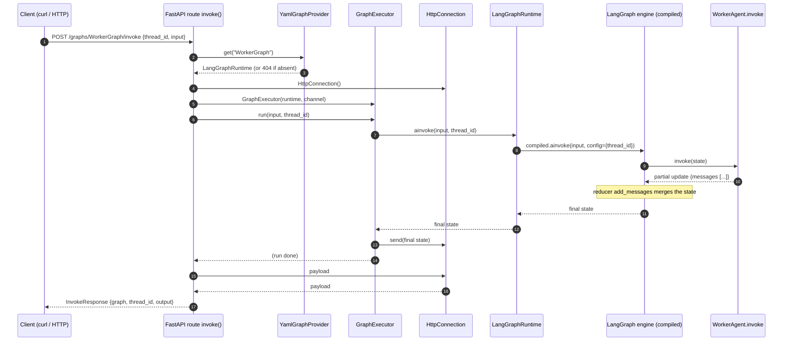

# agentic_platform — Startup and execution (Phase A)

Reference map of the **build/startup** and **per-request** classes, with their
sequence diagrams. It covers the "a linear graph runs end-to-end from YAML" path
(Phase A).

> The diagrams are in **Mermaid** (`sequenceDiagram`). In Confluence you need a macro
> that renders Mermaid (e.g. "Mermaid Diagrams"); on GitHub they render natively.

---

## 1. Build / startup classes (build-time, once at startup)

| Class (interface) | What it does | Who builds it | Output |
|---|---|---|---|
| **PlatformManager** (`AbstractPlatformManager`) | **The deployment initiator**: `run()` does graph-up → serve channel → graph-down. The user's concrete provides `build_factory()`/`build_transport()` (their info) | launched by the user (`PlatformManager().run()`) | *(side-effect)* platform started |
| **YamlGraphProviderFactory** (`GraphProviderFactoryInterface`) | Assembly point: on `open()` it creates checkpointer + builder, globs the `*.yaml`, builds each graph (skips broken ones with a warning) | `PlatformManager.build_factory()` | async context-manager that `yield`s a **`YamlGraphProvider`** |
| **YamlGraphLoader** (`GraphLoaderInterface`) | Reads a YAML file and turns it into the typed model | the **factory** (default `YamlGraphLoader()`) | a **`GraphDTO`** |
| **StaticRegistry** (`RegistryInterface`) | Resolves the YAML **names** → Python objects (agent/router/type/reducer); instantiates + caches; ships the builtins | `PlatformManager.build_factory()` | a `NodeInterface`/`RouterInterface` instance, a `type`, a reducer function |
| **GraphBuilder** (`GraphBuilderInterface`) | `GraphDTO` + registry → `StateGraph`: state-schema, `add_node`/`add_edge`, `compile()` | the **factory**, inside `open()` | a **`GraphRuntimeInterface`** (concretely a `LangGraphRuntime`) |
| **LangGraphRuntime** (`GraphRuntimeInterface`) | Wraps the **compiled** graph; translates `ainvoke`/`get_state` into LangGraph calls with the `thread_id` | the **`GraphBuilder`**, in `build()` | the **final state** (`ainvoke`) / the thread snapshot (`get_state`) |
| **YamlGraphProvider** (`GraphProviderInterface`) | Holds the already-built runtimes (`dict[name → runtime]`); resolves by name | the **factory**, in the `yield` of `open()` | a **`GraphRuntimeInterface`** by name (`get`), the list of names (`names`) |
| **GraphRuntimeActivator** | Opens/closes the factory (`start`/`stop`), keeps the provider ready | **`PlatformManager.run()`** | the **`GraphProviderInterface`** (from `start()`) |
| **HttpTransport** (`TransportInterface`) | Receives the **already-ready provider**, does `create_app(provider)` + `uvicorn.Server(...).serve()` | `PlatformManager.build_transport()` | *(side-effect)* serves the HTTP channel until shutdown |

## 2. Per-request classes (request-time, on every `invoke`)

| Class (interface) | What it does | Who builds it | Output |
|---|---|---|---|
| **HttpConnection** (`ConnectionInterface`) | HTTP output channel: buffers the payload produced by the execution | the **route** `invoke()` (one per request) | the **`payload`** = final state, which the route returns |
| **GraphExecutor** | Coordinates one request: `runtime.ainvoke(...)` then `channel.send(...)` | the **route** `invoke()` (one per request) | *(side-effect)* sends the payload on the channel |

> IoC rule: the user's **`PlatformManager`** (composition root) builds only the entry
> points (Factory+Registry in `build_factory()`, Transport in `build_transport()`);
> then it is the **Factory** that builds the build chain (Loader → Builder → Runtime →
> Provider); the **per-request** classes are built by the **route**. Concretes are born
> at the edges (PlatformManager + factory + route), the core sees only interfaces. Note:
> **the channel does not activate the graph** — `HttpTransport` receives an already-ready
> provider.

---

## 3. Sequence diagram — STARTUP

```mermaid
sequenceDiagram
    autonumber
    participant USR as user (launches)
    participant PM as PlatformManager.run()
    participant ACT as GraphRuntimeActivator
    participant FAC as YamlGraphProviderFactory
    participant LD as YamlGraphLoader
    participant REG as StaticRegistry
    participant BLD as GraphBuilder
    participant RT as LangGraphRuntime
    participant TR as HttpTransport
    participant APP as FastAPI app
    participant UVS as uvicorn.Server

    USR->>PM: PlatformManager().run()
    PM->>TR: build_transport()
    PM->>FAC: build_factory()
    PM->>ACT: GraphRuntimeActivator(factory)
    PM->>ACT: start()
    ACT->>FAC: open()  →  __aenter__()
    Note over ACT,FAC: open() creates the CM; __aenter__ runs its body

    FAC->>FAC: MemorySaver()
    FAC->>BLD: GraphBuilder(registry, checkpointer)
    loop for each graphs/*.yaml
        FAC->>LD: load(path)
        LD-->>FAC: GraphDTO
        FAC->>BLD: build(GraphDTO)
        BLD->>REG: state_type / reducer / agent(name)
        REG-->>BLD: type / reducer / NodeInterface
        Note over BLD: add_node / add_edge / compile()
        BLD->>RT: LangGraphRuntime(compiled)
        BLD-->>FAC: GraphRuntimeInterface
    end
    FAC-->>ACT: yield YamlGraphProvider(runtimes)
    ACT-->>PM: provider (GRAPH READY = green light)

    PM->>TR: serve(provider)
    TR->>APP: create_app(provider)
    Note over APP: app.state.graphs = provider (no lifespan)
    TR->>UVS: uvicorn.Server(...).serve()
    Note over UVS: serves requests until shutdown
    UVS-->>PM: (shutdown)
    PM->>ACT: stop()  (finally: graph down)
```

---

## 4. Sequence diagram — EXECUTION (one `invoke` request)



---

## 5. The thread that ties them together (in brief)

```
STARTUP (once):
  user → PlatformManager().run()
    → Activator.start() → Factory.open()
        → for each YAML:  Loader → GraphDTO → Builder(+Registry) → LangGraphRuntime
        → Provider{name: runtime}                              ← GRAPH READY (green light)
    → HttpTransport.serve(provider) → create_app(provider) → uvicorn.Server.serve()   ← CHANNEL
    → (shutdown) Activator.stop()                              ← GRAPH down

PER REQUEST:
  route invoke() → creates HttpConnection + GraphExecutor(runtime, channel)
    → executor.run() → runtime.ainvoke() → LangGraph engine → channel.send() → response
```
